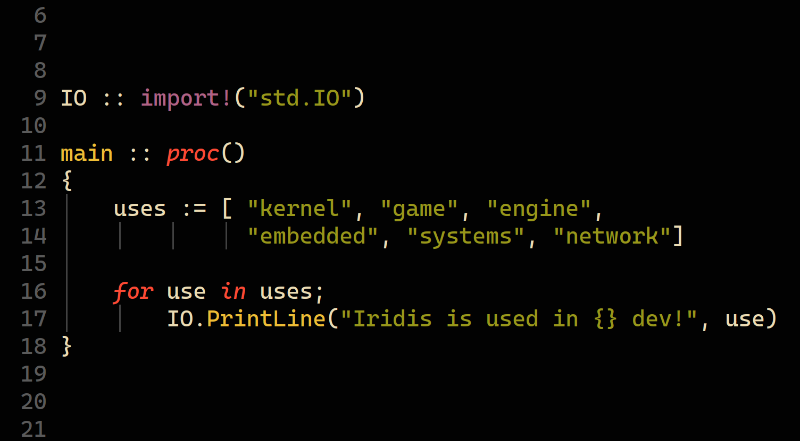

# Iridis

A Fast, Modern, Low-Level General-Purpose Programming Language

Iridis is an innovative programming language designed to cater to the needs of various domains, such as computational physics, kernel development, and game development, while remaining versatile enough to be applicable in many other areas. This language is built from the ground up to offer blazing fast performance, a modern development experience, and low-level control, empowering programmers to tackle complex problems efficiently and effectively.

